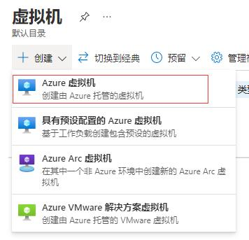
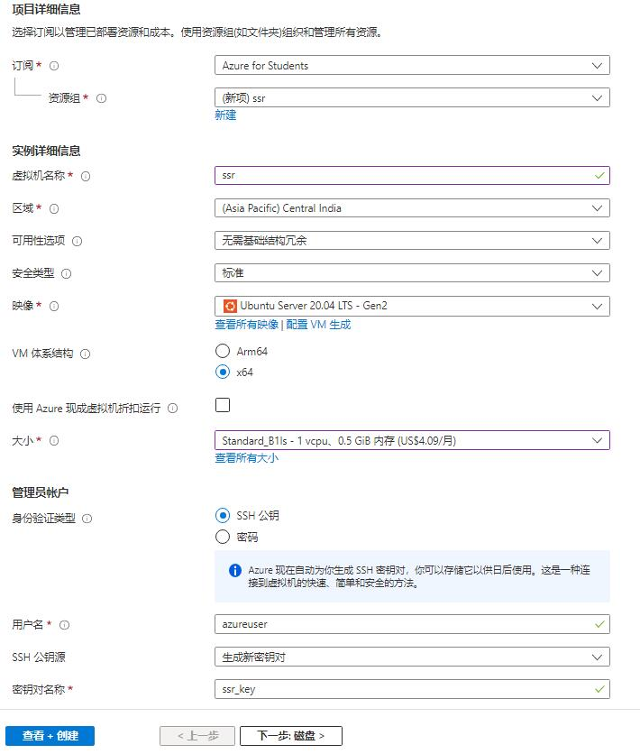
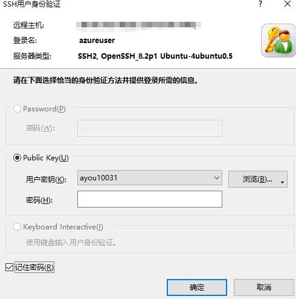
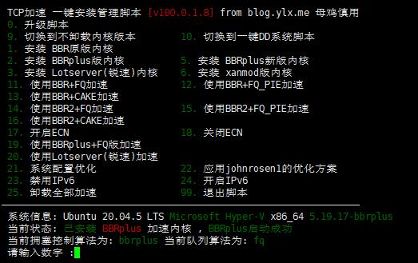
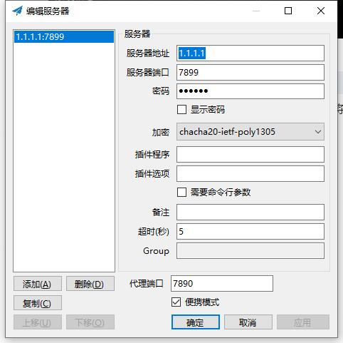

> - 阅读本篇文章请保证您拥有 [**Github 学生资质**](/posts/github-edu/)  
> - 有一定的 Linux 系统基础  
> - 会简单的使用 Docker

## 申请微软 Azure 学生认证

点击[链接](https://aka.ms/azure4students)进行 Azure 学生认证,点击 绿色按钮 `免费开始使用` 跳转到微软登录页面，选择 `使用其他登录方式`->`Github 登录`,之后完善你的个人信息即可完成学生认证，无需信用卡！


## 创建虚拟机

进入 Azure 主页找到 **虚拟机**,点击左上角 `创建`->`Azure虚拟机`,操作配置如下,这里注意选择的大小为 **B1ls** 只要 4.09$/月 况且 0.5G 的内存对于搭建酸酸乳来说足矣！  
 

## 搭建小飞机/酸酸乳

等待创建完成之后我们使用 [Xshell](https://www.xshell.com/zh/xshell/)工具和保存的**私钥**以及**公网IP**连接到远程服务器。  

### 命令

1. 更新服务器
```bash
sudo apt update && sudo apt upgade
```
2. 安装 [Docker](https://docs.docker.com/engine/install/ubuntu/#installation-methods)
```bash
sudo apt-get install \
    ca-certificates \
    curl \
    gnupg \
    lsb-release
```
```bash
sudo mkdir -p /etc/apt/keyrings
curl -fsSL https://download.docker.com/linux/ubuntu/gpg | sudo gpg --dearmor -o /etc/apt/keyrings/docker.gpg
echo \
  "deb [arch=$(dpkg --print-architecture) signed-by=/etc/apt/keyrings/docker.gpg] https://download.docker.com/linux/ubuntu \
  $(lsb_release -cs) stable" | sudo tee /etc/apt/sources.list.d/docker.list > /dev/null
```
```bash
sudo apt-get update
sudo apt-get install docker-ce docker-ce-cli containerd.io docker-compose-plugin
```
3. 安装酸酸乳/小飞机
|变量|说明|
|:---:|:---:|
|SS_PORT|连接端口|
|SS_PASSWORD|验证密码|
|SS_METHOD|协议|


<span id="xieyi"></span>
如果你要使用 SSR 连接，协议请输入 `chacha20-ietf-poly1305`  
如果你要使用 Clash 连接，协议请输入 `chacha20-ietf`


#### SSR 安装命令
```bash
sudo docker run -d --restart=always -e SS_PORT=7899 -e SS_PASSWORD=114514 -e SS_METHOD=chacha20-ietf-poly1305 -p 7899:7899 -p 7899:7899/udp --name ssr imhang/shadowsocks-docker
```
#### Clash 安装命令
```bash
sudo docker run -d --restart=always -e SS_PORT=7899 -e SS_PASSWORD=114514 -e SS_METHOD=chacha20-ietf -p 7899:7899 -p 7899:7899/udp --name ssr imhang/shadowsocks-docker
```

4. Azure 防火墙设置/端口开放
进入你的 **虚拟机控制台** 找到 `网络`->`添加入站端口规则`->`目标端口范围` 填 `7899`->`添加`
5. 安装 BBR 加速
```bash
wget --no-check-certificate https://github.com/teddysun/across/raw/master/bbr.sh
sudo bash bbr.sh
```
按任意键完成安装

6. 安装 BBR PLUS 加速 (可选)
```bash
sudo apt-get install ca-certificates wget -y && sudo update-ca-certificates
wget -O tcp.sh "https://git.io/coolspeeda" && sudo bash tcp.sh
```
输入数字 `5`,等待安装...遇到界面选择`No`,安装完成后`sudo reboot` 重启服务器,重启完成继续打开界面选择 `19. 使用BBRPlus+FQ版加速` 再次重启服务器  


7. 验证BBR是否安装/开启
```bash
$ sysctl net.ipv4.tcp_available_congestion_control | grep bbr
# 若已开启bbr，结果如下：
net.ipv4.tcp_available_congestion_control = reno bbr bbrplus
$ sysctl net.ipv4.tcp_congestion_control | grep bbr
# 若已开启bbr，结果如下：
net.ipv4.tcp_congestion_control = bbrplus
$ sysctl net.core.default_qdisc | grep fq
# 若已开启bbr，结果如下：
net.core.default_qdisc = fq
$ lsmod | grep bbr
# 若已开启bbr，结果可能如下。并不是所有的 VPS 都会有此返回值，若没有也属正常。
tcp_bbr                20480  2
```

到此为止，酸酸乳的搭建和加速就已经完成了，下面我们将连接到小飞机。

## 连接酸酸乳/小飞机
### SHadowsocksR
对于 `ssr` 协议，我们需要专门的客户端进行连接
- [Windows](https://github.com/shadowsocks/shadowsocks-windows)
- [其他](https://blog.skihome.xyz/posts/cf71037e/)

#### 配置



### Clash
对于 `Clash` 我们需要把[协议](#xieyi) 改为 `chacha20-ietf` 
- [Windows](https://github.com/Fndroid/clash_for_windows_pkg/releases)  

[Clash 配置](https://gist.github.com/Ayouuuu/107f128f9c8f3fc2d6a656a816e823cd) [:(fa-solid fa-file-arrow-down):](./config.yml)
