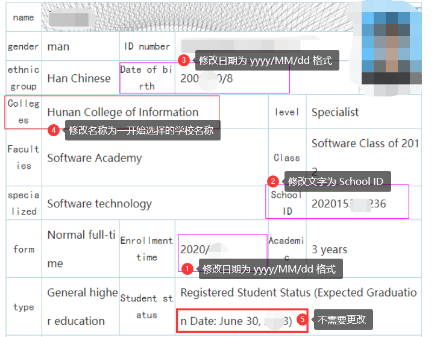
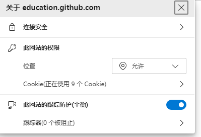
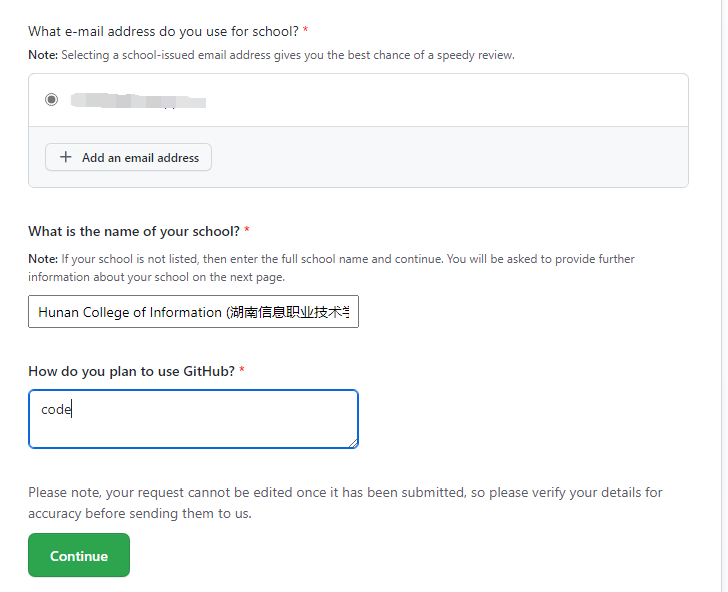
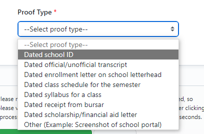
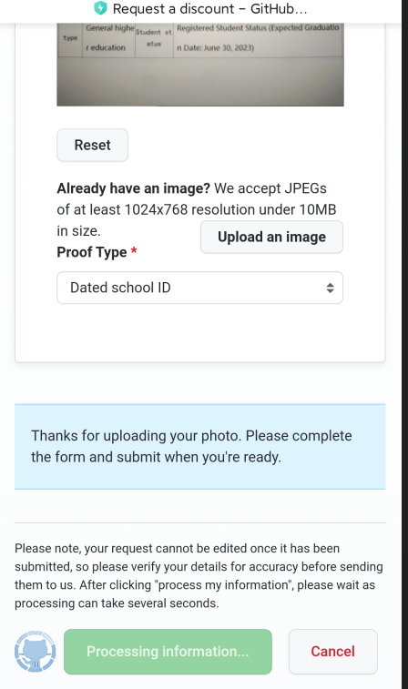
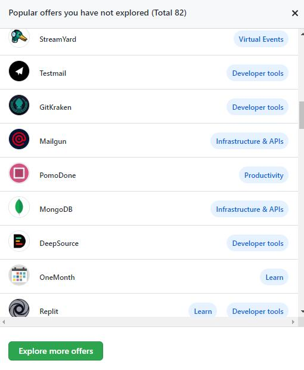
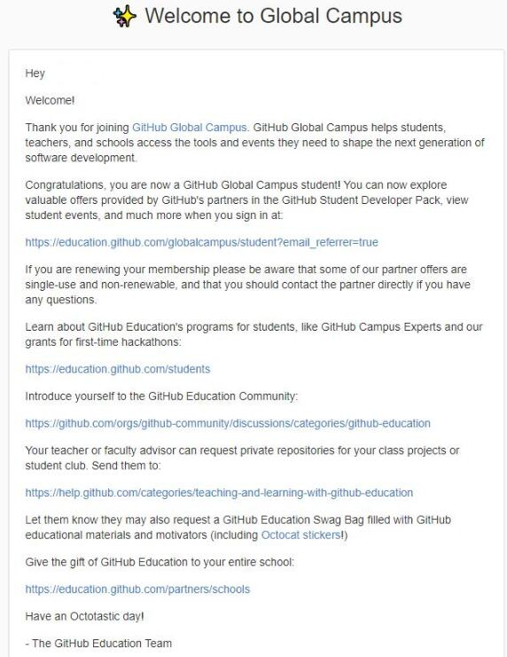
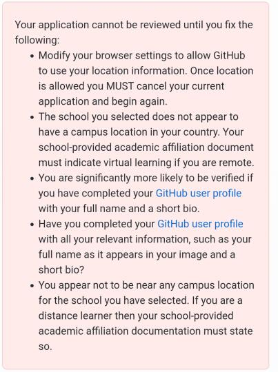

> 此篇文章用来记录个人申请学生认证以及帮助同学申请所得出来的经验，希望能够帮助到您！

## 准备

- [Github](https://github.com) 账号
- 一台能够上 Github 的手机(不能使用VPN)
  - 能开启后置摄像头
  - 开启位置服务
- 学信网教育认证英文图片

## 详细步骤

### 学信网认证图片
先使用翻译软件成英文，然后使用 **审查元素** 进行相关修改,修改完毕保存截图。

<!-- -->

### Github 认证



**建议使用手机操作**



首先进入 [Github Education Student](https://education.github.com/pack/join)允许位置请求,选择 Student 和您的学校以及填入相关信息后,点击绿色按钮 **Continue** 进入下一步  
     
点击 `Take a picture`->`Take photo` 选择 **后置摄像头**,拍摄(**竖着拍**)刚刚保存的学信网截图(不要使用护眼模式等，要纯白色的屏幕),等待上传完毕后,`Proof Type` 选择 `Dated school ID`，全部准备完成后点击绿色按钮等待完成机器检查。  
 

#### 恭喜你
{{
详情">}}
当你收到 **Github** 的邮件，则代表你已经通过了认证啦~已经可以享受多达 **82种** 服务 **Jetbrains 订阅**、**微软 Azure 服务器** 等等  


<!--  -->
{{
}}

### 遇到了问题?
<!--  -->

1. 允许浏览器获取位置信息
2. 拿不到位置信息
3. 完善 [Github user profile](https://github.com/settings/profile)
4. 完善 [Github user profile](https://github.com/settings/profile) 
5. 位置定位出错，请不要使用任何代理

其中 `3`和`4` 固定出现可以不怎么管， `5`和`2`以及`1` 需要点击 **Cancel** 取消当前工单，再次申请开一个新的工单继续提交(看运气),一定要确保没有代理,因为以前的工单号已经绑定了位置信息，所以你怎么提交也是不行的，因为位置信息和工单绑定，只能重开一个！  
言简意赅: `不要开代理，拍照用竖屏，完善个人信息，多多尝试！`

